# Create your AI Agent with MCP and LangChain.js

In this workshop, we'll explore how to build an AI agent that can interact with a burger restaurant API using LangChain.js and the Model Context Protocol (MCP). Your agent will be able to answer questions about the menu, provide recommendations, and place orders, all through a web interface.

We'll cover how to set up an MCP server and connect it to an existing REST API handling menu and orders data, allowing your LangChain.js agent to fetch real-time information and perform actions on behalf of users. 

## You'll learn how to...

- Build an AI agent using [LangChain.js](https://docs.langchain.com/oss/javascript/langchain/overview).
- Create an MCP (Model Context Protocol) server with [Express](https://expressjs.com) to allow the AI agent to connect with a REST API.
- Use *context engineering* to improve the performance of your AI agent.
- Use [OpenAI](https://openai.com) models and [LangChain.js](https://js.langchain.com/docs/) to generate answers based on a prompt.
- Create a serverless Web API with [Azure Functions](https://learn.microsoft.com/azure/azure-functions/).
- Connect your agent API to a chat website.
- Deploy the API, MCP server and web app as serverless applications on Azure.

## Prerequisites

<div data-hidden="$$proxy$$">

| | |
|----------------------|------------------------------------------------------|
| GitHub account       | [Get a free GitHub account](https://github.com/join) |
| Azure account        | [Get a free Azure account](https://aka.ms/devrelft) |
| A Web browser        | [Get Microsoft Edge](https://www.microsoft.com/edge) |
| JavaScript knowledge | [JavaScript tutorial on MDN documentation](https://developer.mozilla.org/docs/Web/JavaScript)<br>[JavaScript for Beginners on YouTube](https://www.youtube.com/playlist?list=PLlrxD0HtieHhW0NCG7M536uHGOtJ95Ut2) |
| Basic LLM knowledge | [Introduction to Large Language Models](https://www.youtube.com/watch?v=GQ_2OjNZ9aA&list=PLlrxD0HtieHi5ZpsHULPLxm839IrhmeDk&index=2) |

</div>

<div data-visible="$$proxy$$">

| | |
|--------------------------|------------------------------------------------------|
| GitHub account           | [Get a free GitHub account](https://github.com/join) |
| Azure account (optional) | [Get a free Azure account](https://aka.ms/devrelft) |
| A Web browser            | [Get Microsoft Edge](https://www.microsoft.com/edge) |
| JavaScript knowledge     | [JavaScript tutorial on MDN documentation](https://developer.mozilla.org/docs/Web/JavaScript)<br>[JavaScript for Beginners on YouTube](https://www.youtube.com/playlist?list=PLlrxD0HtieHhW0NCG7M536uHGOtJ95Ut2) |
| Basic LLM knowledge      | [Introduction to Large Language Models](https://www.youtube.com/watch?v=GQ_2OjNZ9aA&list=PLlrxD0HtieHi5ZpsHULPLxm839IrhmeDk&index=2) |

</div>

We'll use [GitHub Codespaces](https://github.com/features/codespaces) to have an instant dev environment already prepared for this workshop.

If you prefer to work locally, we'll also provide instructions to setup a local dev environment using either VS Code with a [dev container](https://aka.ms/vscode/ext/devcontainer) or a manual install of the needed tools.

<div class="info" data-title="note">

> Your Azure account must have `Microsoft.Authorization/roleAssignments/write` permissions, such as [Role Based Access Control Administrator](https://learn.microsoft.com/azure/role-based-access-control/built-in-roles#role-based-access-control-administrator-preview), [User Access Administrator](https://learn.microsoft.com/azure/role-based-access-control/built-in-roles#user-access-administrator), or [Owner](https://learn.microsoft.com/azure/role-based-access-control/built-in-roles#owner). Your account also needs `Microsoft.Resources/deployments/write` permissions at a subscription level to allow deployment of Azure resources.
>
> If you have your own personal Azure subscription, you should be good to go. **If you're using an Azure subscription provided by your company, you may need to contact your IT department to ensure you have the necessary permissions**.

</div>


---

## Introduction

When it was introduced, generative AI was mostly limited to answering questions, and could not take actions. This left users to manually perform tasks based on the AI's suggestions. With the advent of AI agents and standard protocols like MCP (Model Context Protocol), we can now build AI systems that can autonomously interact with APIs and services to perform tasks of varying complexity, moving beyond simple Q&A.

When integrated in existing systems, like in this case a burger ordering service, AI agents can improve the user experience by streamlining interactions and providing personalized assistance. They can understand user preferences, make recommendations, and even place orders. Imagine an assistant available 24/7, capable of handling multiple requests simultaneously, all while providing a personalized experience. This is what AI agents bring to the table.

<div class="warning" data-title="Accuracy in Generative AI">

> Large Language Models (LLMs), like the ones powering ChatGPT, do not have by design direct access to the external world. They may produce "hallucinations", offering responses that seem authoritative but are factually incorrect. It's crucial to **inform users that the responses are AI-generated**. During this workshop, we'll explore how to provide LLMs a limited access to external information sources and possible actions, allowing them to *ground* their answers and reduce hallucinations.

</div>

In this workshop, we'll guide you through building an AI agent that can assist users with several tasks, through the usage of a business API. We'll touch on many different topics, but we'll take it one step at a time.

### Application architecture

Below is the architecture of the application we're going to build:

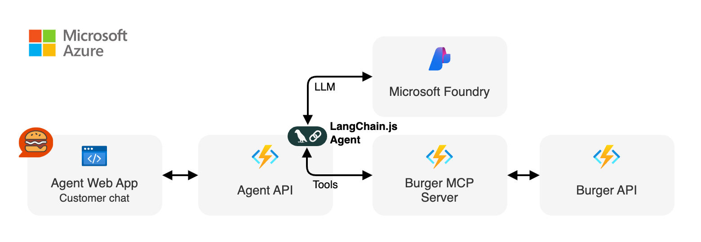

Our application consists of five main components:

1. **Burger API**: This is the existing business API that provides information about the menu and orders. In a real-world scenario, this could be any API relevant to your business domain.

2. **Burger MCP server**: This server exposes the burger API as a Model Context Protocol (MCP) service.

3. **Agent API**: This API hosts the LangChain.js AI agent, which processes user requests and interacts with the burger API through the MCP server.

4. **Agent Web App**: This site offers a chat interface for users to send requests to the Agent API and view the generated responses.

5. **Microsoft Foundry model**: We will use the `gpt-5-mini` model, hosted on Azure, for this workshop. The code can also be adapted to work with OpenAI API or Ollama with minimal changes.

### What's an AI Agent?

An AI agent is an autonomous software system that can perceive its environment, make decisions, and take actions to achieve specific goals. Unlike traditional chatbots that only respond to questions, AI agents can:

- **Understand context and intent** from user requests
- **Plan and execute multi-step tasks** by breaking down complex problems
- **Interact with external systems** like APIs, databases, and services
- **Learn and adapt** from previous interactions to improve performance
- **Make decisions autonomously** based on available information and defined objectives

In essence, AI agents bridge the gap between **conversation** and **action**, enabling AI systems to not just talk about tasks, but actually perform them.

There are two key concepts to understand when working with AI agents: **tools** and **workflows**.

1. **Tools**: Tools are external functions or APIs that the agent can use to perform specific actions. In our case, the burger API is exposed through multiple MCP tools that the agent can call to retrieve menu information or act on orders.

2. **Workflows**: Workflows define the sequence of steps the agent takes to accomplish a task. This includes deciding which tools to use, in what order, and how to process the information received from those tools to generate a final response.

For common use cases like our burger ordering assistant, AI agents can follow this workflow that works as a decision loop:

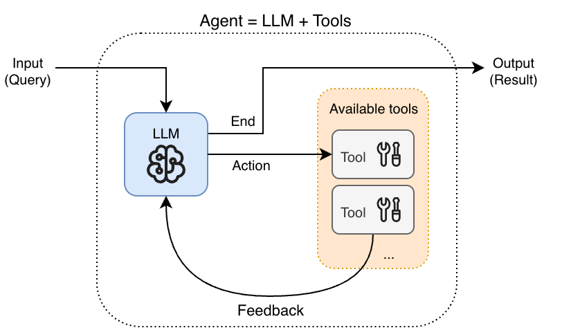

The flow goes like this:
1. The user send in a query, like “order a vegan burger”.
2. The LLM decides which tool to call.
3. Based on the feedback from the tool calling, it decides the next action: call another tool, or return the final answer.

### What's MCP (Model Context Protocol)?

The Model Context Protocol (MCP) is a standardized way for AI models to interact with external tools and data. It defines how models can request information, perform actions, and receive responses in a structured manner. It’s an open-source protocol that has seen fast adoption in the AI community, enabling interoperability between different AI systems and tool providers. MCP has [joined the Linux Foundation](https://www.anthropic.com/news/donating-the-model-context-protocol-and-establishing-of-the-agentic-ai-foundation) to further accelerate its development and adoption.

One of its main usages is to act as "the glue" that allows to connect tool providers with any AI agent. By implementing an MCP server, tool providers can expose their APIs in a way that AI agents can easily discover and use them, without needing custom integration for each agent, model or framework.

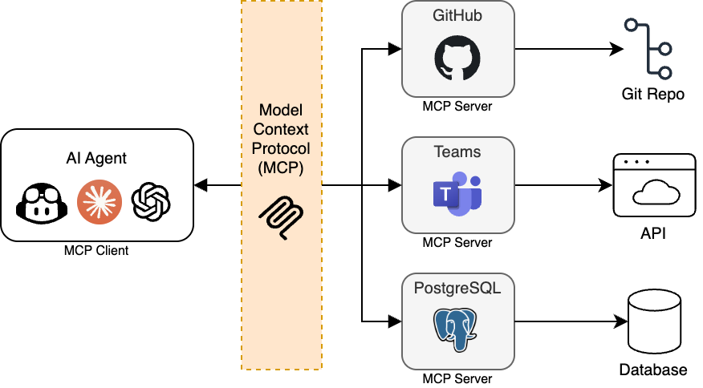

MCP requires two main components to work together:

1. **MCP Server**: This server exposes the tools in a standardized format, describing the usage and parameters of each tool.
2. **MCP Client**: This client is integrated into the AI agent, allowing it to discover and call the tools exposed by the MCP server.

An offical MCP SDK is available for many languages, including TypeScript. In this workshop, we will use the TypeScript MCP SDK to create an MCP server that exposes the burger API as a set of MCP tools, and use the MCP client with LangChain.js to allow our AI agent to interact with those tools.

<div class="info" data-title="note">

> While the main usage of MCP is to provide tools, it supports [other features](https://modelcontextprotocol.io/specification/latest) as well, both from the server and client side, like exposing data resources and prompts to the agents. In this workshop, we will focus exclusively on the tool aspect of MCP.

</div>


---

## Preparation

Before diving into development, let's set up your project environment. This includes:

- Creating a new project on GitHub based on a template
- Using a prepared dev container environment on either [GitHub Codespaces](https://github.com/features/codespaces) or [VS Code with Dev Containers extension](https://aka.ms/vscode/ext/devcontainer) (or a manual install of the needed tools)

### Creating your project

1. Open [this GitHub repository](https://github.com/Azure-Samples/mcp-agent-langchainjs)
2. Click the **Fork** button and click on **Create fork** to create a copy of the project in your own GitHub account.

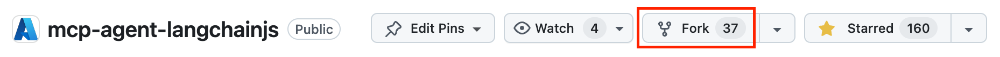

Once the fork is created, select the **Code** button, then the **Codespaces** tab and click on **Create Codespaces on main**.

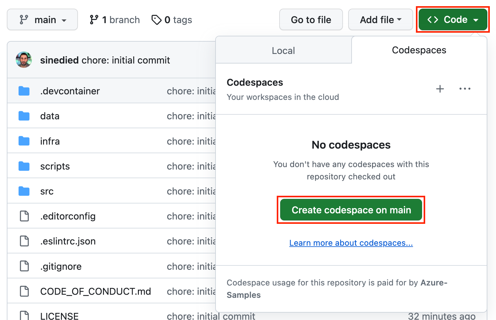

This will initialize a development container with all necessary tools pre-installed. Once it's ready, you have everything you need to start coding. Wait a few minutes after the UI is loaded to ensure everything is ready, as some tasks will be triggered after everything is fully loaded, such as the installation of the npm packages with `npm install`.

<div class="info" data-title="note">

> GitHub Codespaces provides up to 60 hours of free usage monthly for all GitHub users. You can check out [GitHub's pricing details](https://github.com/features/codespaces) for more information.

</div>

#### [optional] Local development with the dev container

If you prefer working on your local machine, you can also run the dev container on your machine. If you're fine with using Codespaces, you can skip directly to the next section.


1. Ensure you have [Docker](https://www.docker.com/products/docker-desktop), [VS Code](https://code.visualstudio.com/), and the [Dev Containers extension](https://aka.ms/vscode/ext/devcontainer) installed.

<div class="tip" data-title="tip">

> You can learn more about Dev Containers in [this video series](https://learn.microsoft.com/shows/beginners-series-to-dev-containers/). You can also [check the website](https://containers.dev) and [the specification](https://github.com/devcontainers/spec).

</div>

2. In GitHub website, select the **Code** button, then the **Local** tab and copy your repository url.

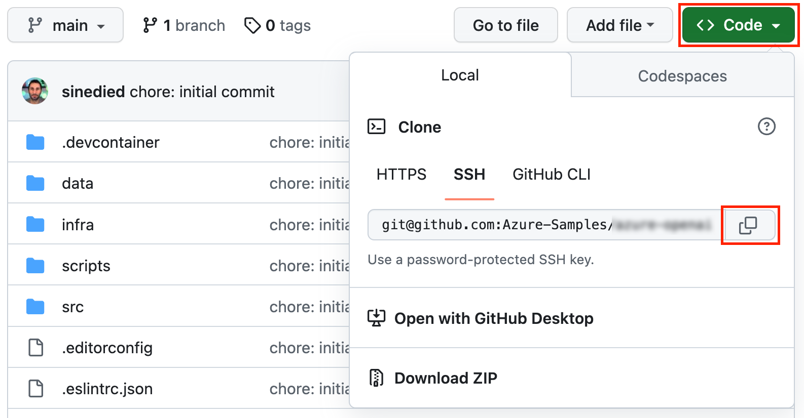
3. Clone your forked repository and then open the folder in VS Code:

   ```bash
  git clone <your_repository_url>
   ```

3. In VS Code, use `Ctrl+Shift+P` (or `Command+Shift+P` on macOS) to open the **command palette** and type **Reopen in Container**.

   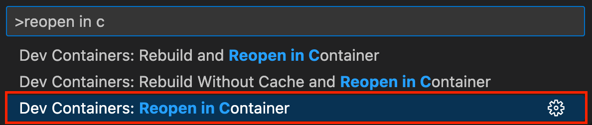

   *Alt text: Screenshot of VS Code showing the "Reopen in Container" command.*

The first time it will take some time to download and setup the container image, meanwhile you can go ahead and read the next sections.

Once the container is ready, you will see "Dev Container: OpenAI Workshop" in the bottom left corner of VSCode:


#### [optional] Working locally without the dev container

If you want to work locally without using a dev container, you need to clone the project and install the following tools:

| | |
|---------------|--------------------------------|
| Git           | [Get Git](https://git-scm.com) |
| Node.js v22+  | [Get Node.js](https://nodejs.org) |
| GitHub CLI    | [Get GitHub CLI](https://github.com/cli/cli#installation) |
| Azure Developer CLI | [Get Azure Developer CLI](https://learn.microsoft.com/azure/developer/azure-developer-cli/install-azd) |
| Azure CLI     | [Get Azure CLI](https://learn.microsoft.com/cli/azure/install-azure-cli) |
| Bash v3+      | [Get bash](https://www.gnu.org/software/bash/) (Windows users can use **Git bash** that comes with Git) |
| A code editor | [Get VS Code](https://aka.ms/get-vscode) |

You can test your setup by opening a terminal and typing:

```sh
git --version
node --version
gh --version
azd version
az --version
bash --version
```


---

## Complete the setup

To complete the template setup, please run the following command in a terminal, **at the root of the project**:

```bash
./docs/workshop/setup-template.sh
```

### Preparing the environment

After the template setup is complete, we'll prepare a `.env` file with the necessary environment variables to run the project.

<div data-visible="$$proxy$$">

We have deployed an OpenAI proxy service for you, so you can use it to work on this workshop locally before deploying anything to Azure.

Create a `.env` file at the root of the project, and add the following content:

<div data-visible="$$burger_api$$">

```
AZURE_OPENAI_API_ENDPOINT=$$proxy$$
BURGER_API_URL=$$burger_api$$
```

</div>
<div data-hidden="$$burger_api$$">

```
AZURE_OPENAI_API_ENDPOINT=$$proxy$$
```

</div>

</div>

<div data-hidden="$$proxy$$">

Now you either have to deploy an Azure OpenAI service to use the OpenAI API, or you can use a local emulator based on Ollama and an open-source LLM.

#### Using Azure OpenAI

You first need to deploy an Azure OpenAI service to use the OpenAI API.

Before moving to the next section, go to the **Azure setup** section (either on the left or using the "hamburger" menu depending of your device) to deploy the necessary resources and create your `.env` file needed.

After you completed the Azure setup, come back here to continue the workshop.

At this point you should have a `.env` file at the root of the project that contains the required environment variables to connect to your Azure resources.

#### [optional] Using Ollama

If you have a machine with enough resources, you can run this workshop entirely locally without using any cloud resources. To do that, you first have to install [Ollama](https://ollama.com) and then run the following commands to download the models on your machine:

```bash
ollama pull qwen3:8b
```

<div class="info" data-title="Note">

> The `qwen3:8b` model downloads a few gigabytes of data, so it can take some time depending on your internet connection.

</div>

<div class="important" data-title="Important">

> Ollama works in GitHub Codespaces, but runs **very very slow** currently. If you want to use the Ollama option, it will work best if you are working on the workshop on your local machine directly.

</div>

Once the model are downloaded, create a `.env` file at the root of the project, and add the following content:

<div data-visible="$$burger_api$$">

```
AZURE_OPENAI_API_ENDPOINT=http://localhost:11434
AZURE_OPENAI_MODEL=qwen3:8b
BURGER_API_URL=$$burger_api$$
```

</div>
<div data-hidden="$$burger_api$$">

```
AZURE_OPENAI_API_ENDPOINT=http://localhost:11434
AZURE_OPENAI_MODEL=qwen3:8b
```

</div>

</div>

### Getting your personal user ID

To interact with the Burger API, you will need a personal user ID.

<div data-visible="$$burger_api$$">

Open $$register_url$$ in a browser and login with a GitHub or Microsoft account to register and get your unique user ID.

</div>
<div data-hidden="$$burger_api$$">

To get your personal user ID, we'll start a local registration service that will create the user ID.

Run the following command in a new terminal, at the root of the project:

```bash
npm run start:agent
```

Then open `http://localhost:4280/register.html` in a browser to register and get your unique user ID.

When trying to log in, you'll be prompted by the Azure Static Web Apps authentication emulator. Enter a username and select **Login** to proceed.

</div>

You should then see your unique user ID displayed on the page:


Copy your user ID and add it to your `.env` file as follows:

```
USER_ID=your-unique-user-id
```

This ID will allow you to place orders and interact with the burger orders on the API throughout the workshop.


---

## Overview of the project

The project template you've forked is a monorepo, which means it's a single repository that houses multiple projects. Here's how it's organized, focusing on the key files and directories:

```sh
.devcontainer/    # Development container configuration
infra/            # Azure infrastructure as code (IaC) files
packages/         # Source code for the application's services
|- burger-api/    # Burger REST API that handles menu and orders
|- burger-mcp/    # Burger MCP server to expose the burger API as MCP tools
|- agent-api/     # Agent API, hosting the LangChain.js agent
|- agent-webapp/  # Web application to interact with the agent
package.json      # NPM workspace configuration
.env              # File that you created for environment variables
```

We're using Node.js for our servers and website, and have set up an [NPM workspace](https://docs.npmjs.com/cli/using-npm/workspaces) to manage dependencies across all projects from a single place. Running `npm install` at the root installs dependencies for all projects, simplifying monorepo management.

For instance, `npm run <script_name> --workspaces` executes a script across all projects, while `npm run <script_name> --workspace=backend` targets just the backend.

Otherwise, you can use your regular `npm` commands in any project folder and it will work as usual.

### About the services

We generated the initial code for our differents services with the respective CLI or generator of the frameworks we'll be using, and we've pre-written several service components so you can jump straight into the most interesting parts.

### Burger API

This is a REST API handling burger menu and orders for the restaurant. You can consider it as an existing business API of your company, and use it like an external service that your servers will interact with.

<div data-visible="$$burger_api$$">

We have deployed the Burger API for you, so you can use it to work on this workshop as if you were using a remote third-party service. We'll set up a live dashboard for you so can monitor your orders live as you're progressing in the workshop.

You can access the API at `$$burger_api$$/api`.

The complete API documentation is available by opening the [Swagger Editor](https://editor.swagger.io/?url=$$burger_api$$/api/openapi) or the [OpenAPI YAML file]($$burger_api$$/api/openapi). A quick overview of the available endpoints is also provided below.

</div>
<div data-hidden="$$burger_api$$">

The first thing you need is to start the Burger API. Even if it's running locally, you can treat it as a third-party service that your server will interact with.

To start the service, run the following command in a terminal at the root of the project:

```bash
npm start:burger
```

You can then access the API at `http://localhost:7071/api`.

The complete API documentation is available by opening the [Swagger Editor](https://editor.swagger.io/?url=http://localhost:7071/api/openapi) or the [OpenAPI YAML file](http://localhost:7071/api/openapi). A quick overview of the available endpoints is also provided below.


<div class="important" data-title="important">

> Leave this terminal running, as the API needs to be up and running for the rest of the workshop.

</div>

</div>

#### API Endpoints

The Burger API provides the following endpoints:

| Method | Path                     | Description                                                                                                                                  |
| ------ | ------------------------ | -------------------------------------------------------------------------------------------------------------------------------------------- |
| GET    | /api                     | Returns basic server status information including active and total orders                                                                    |
| GET    | /api/openapi             | Returns the OpenAPI specification in YAML format (add `?format=json` for JSON)                                                               |
| GET    | /api/burgers             | Returns a list of all burgers                                                                                                                |
| GET    | /api/burgers/{id}        | Retrieves a specific burger by its ID                                                                                                        |
| GET    | /api/toppings            | Returns a list of all toppings (can be filtered by category with `?category=X`)                                                              |
| GET    | /api/toppings/{id}       | Retrieves a specific topping by its ID                                                                                                       |
| GET    | /api/toppings/categories | Returns a list of all topping categories                                                                                                     |
| GET    | /api/orders              | Returns a list of all orders in the system                                                                                                   |
| POST   | /api/orders              | Places a new order with burgers (requires `userId`, optional `nickname`)                                                                     |
| GET    | /api/orders/{orderId}    | Retrieves an order by its ID                                                                                                                 |
| DELETE | /api/orders/{orderId}    | Cancels an order if it has not yet been started (status must be 'pending', requires `userId` as a query parameter (e.g., `?userId={userId}`) |
| GET    | /api/images/{filepath}   | Retrieves image files (e.g., /api/images/burgers/burger-1.jpg)                                                                               |

#### Order Limits

A user can have a maximum of **5 active orders** (status: `pending` or `in-preparation`) at a time. Additionally, a single order cannot exceed **50 burgers** in total across all items.

These limits ensure fair use and prevent abuse.

### Agent API specification

To create a chat-like experience with our agent, we need to define how the user interface and the agent API will communicate. For this, we use a JSON-based protocol described below. For your own projects, you can choose to extend or implement a different protocol if needed.

#### Chat request

A chat request is sent in JSON format, and must contain at least the user's message. Optional parameters include context-specific data that can tailor the agent service's behavior.

```json
{
  "messages": [
    {
      "content": "Do you have fish-based burgers on the menu?",
      "role": "user"
    }
  ],
  "context": { ... }
}
```

#### Chat response

As agent tasks can involve multiple steps and take some time, the agent API will stream responses so intermediate feedback can be provided to the user interface. The response will then be a stream of JSON objects, each representing a chunk of the response. This format allows for a dynamic and real-time messaging experience, as each chunk can be sent and rendered as soon as it's ready.

We use the [Newline Delimited JSON (NDJSON)](https://github.com/ndjson/ndjson-spec) format, which is a convenient way of sending structured data that may be processed one record at a time.

Each JSON chunk can be one of the following types:

1. **Tool calling**

When the agent decides to call a tool, it sends a message with the tool's name and input parameters.

```json
{
  "delta": {
    "context": {
      "currentStep": {
        "type": "tool",
        "name": "get_burgers",
        "input": null
      }
    }
  }
}
```

2. **LLM response**

When the agent is processing a step that involves the LLM, it sends a message with the current content generated.

```json
{
  "delta": {
    "context": {
      "currentStep": {
        "type": "llm",
        "name": "ChatOpenAI",
        "input": { ... },
        "output": { ... }
      }
    }
  }
}
```

3. **Streaming final answer**

When the agent has completed its task and has a final answer for the user, it streams the content of the answer a few words or characters at a time.

```json
{
  "delta": {
    "content": "Yes, we have",
    "role": "assistant"
  }
}
```


---

## MCP server

We'll start by creating the MCP server. Its role is to expose the Burger API as MCP tools that can later be used by our LangChain.js agent.

### About the MCP SDK

To implement the MCP server, we'll use the [MCP TypeScript SDK](https://github.com/modelcontextprotocol/typescript-sdk), which provides the necessary tools to create MCP-compliant servers and clients. The MCP TypeScript SDK also needs [Zod](https://zod.dev) as a dependency to define and validate the data schemas used in MCP messages: it's used to ensure the typing safety of the data exchanged between the MCP server and its clients, as well as define the parameters shapes for the tools exposed by the MCP server.

<div class="tip" data-title="tip">

> The MCP SDK is available in many languages, so you can choose you favorite technology to implement and use MCP servers and clients. You can find the list of available SDKs on the [official MCP SDKs page](https://modelcontextprotocol.io/docs/sdk). It's also possible to mix and match different languages for the server and client, as all SDKs are compatible with each other.

</div>

[Express](https://expressjs.com) will be used to create the MCP server, as it's a lightweight and flexible web framework for Node.js directly supported by the MCP TypeScript SDK, but you can use any other web framework of your choice.

### MCP transports

MCP uses UTF-8 encoded JSON-RPC messages to communicate between clients and servers. There are two transport methods supported by MCP for sending and receiving these messages:

1. **stdio**: This method uses standard input and output streams for communication. It's typically used for local communication between processes on the same machine.
2. **Streamable HTTP**: This method uses HTTP streams for communication. It's suitable for remote communication over a network.

Note that it's also possible to implement custom transport methods if needed, but it will break compatibility with community-shared MCP clients and servers.

For our use case, we'll use the Streamable HTTP transport, as our LangChain.js agent will communicate with the MCP server over HTTP. If you're interested, there's an optional section at the end of this workshop that explains how to also support stdio transport in the MCP server.

### Initializing the MCP server

First, let's start by installing the required dependencies. Go to the `packages/burger-mcp` folder and run the following command to install the MCP SDK:

```bash
cd packages/burger-mcp
npm install @modelcontextprotocol/sdk zod
```

Open the `src/mcp.ts` file and add these imports at the top of the file:

```ts
import { McpServer } from '@modelcontextprotocol/sdk/server/mcp.js';
import { z } from 'zod';
import { burgerApiUrl } from './config.js';
```

Next, initialize the MCP server by adding the following code at the bottom of the `src/mcp.ts` file:

```ts
export function getMcpServer() {
  const server = new McpServer({
    name: 'burger-mcp',
    version: '1.0.0',
  });

  // Add tools here

  return server;
}
```

Here we simply create a new MCP server instance. The only two required parameters are the server name and version, but you can also provide additional metadata such as a description or website URL. You can explore the available options by check the `McpServer` type definition in your IDE: in VS Code, you can hover on `McpServer` to peek at its definition.

By creating a helper function that returns the MCP server instance, we can more easily reuse it later with different transports (HTTP and stdio).

### Adding burger API tools

The next step is to add tools to the MCP server that will expose the Burger API endpoints. Here we'll have each tool correspond to a specific API endpoint, but in more complex use-cases, a tool could also wrap multiple API calls or implement additional logic.

Since we want to expose multiple endpoints from the Burger API, let's first create a helper function to avoid repeating the same code for each tool. Add the following function after the `getMcpServer` function, to wrap the `fetch` call to the Burger API:

```ts
// Wraps standard fetch to include the base URL and handle errors
async function fetchBurgerApi(url: string, options: RequestInit = {}): Promise<Record<string, any>> {
  const fullUrl = new URL(url, burgerApiUrl).toString();
  console.error(`Fetching ${fullUrl}`);
  try {
    const response = await fetch(fullUrl, {
      ...options,
      headers: {
        ...options.headers,
        'Content-Type': 'application/json',
        Accept: 'application/json',
      },
    });
    if (!response.ok) {
      throw new Error(`Error fetching ${fullUrl}: ${response.statusText}`);
    }

    if (response.status === 204) {
      return { result: 'Operation completed successfully. No content returned.' };
    }

    return await response.json();
  } catch (error: any) {
    console.error(`Error fetching ${fullUrl}:`, error);
    throw error;
  }
}
```

This function takes care of building the full URL, setting the required headers for JSON, and handling errors. It returns the response body as a an object, that we'll later format as an MCP response.

<div class="info" data-title="Note">

> If you look closely, you'll see that we're using `console.error` to log messages instead of `console.log`. This is because MCP servers use standard output (stdout) for sending MCP messages when using the **stdio** transport, so logging to stdout could interfere with the MCP communication. By using standard error (stderr) for logging, we ensure that our logs don't mix with the MCP messages.

</div>

#### Implementing our first tool

Next, inside the `getMcpServer` function, we can add our first tool to get the list of available burgers from the Burger API. Add the following code after the `// Add tools here` line:

```ts
  // Get the list of available burgers
  server.registerTool(
    'get_burgers',
    { description: 'Get a list of all burgers in the menu' },
    async () => {
      const burgers = await fetchBurgerApi('/api/burgers');
      return {
        structuredContent: { result: burgers },
        content: [
          {
            type: 'text' as const,
            text: JSON.stringify(burgers),
          }
        ]
      };
    },
  );
```

And here we have registered our first tool! The `registerTool` method takes 3 parameters:

1. **The tool name:** this is how the tool will be identified by MCP clients, this must be unique within the server. Note that tool names must follow [specific rules](https://modelcontextprotocol.io/specification/latest/server/tools#tool-names).

2. **The tool config:** this object contains metadata about the tool, such as its description, input and output schemas, etc. **It's strongly recommended to always provided a description for each tool**, as it will help the LLM understand what the tool does and when to use it. You can optionally provide input and output schemas using Zod to define the expected parameters and return values of the tool, but for this simple tool we don't need any input parameters. As the output format is controlled by the API, we'll skip defining it here for simplicity but you can add it when you need to enforce stricter output typing.

3. **The tool handler implementation**: this function contains the actual logic of the tool, and returns the result. The content may return *unstructured content* such as text, audio or images, or *structured content* such as JSON objects or arrays. Our API always return JSON objects, so we'll return the response in the `structuredContent` field of the MCP response. For backward compatibility, it's also recommended to result the JSON result as text in the `content` array field. Note that structured content value can **only be an object**! Our API here returns an array of burgers, so we wrap it in an object with a `result` property.

<div class="info" data-title="Note">

> The `structuredContent` field was recently added to the spec, so it's also suggested to include a textual representation of the structured content in the `content` field when possible, to ensure compatibility with older MCP clients that don't support structured content yet.

</div>

#### Handling errors

What happens if the API request fails for some reason? In that case, the `fetchBurgerApi` function will throw an error, and we need to catch it to return a proper MCP error response. Let's build a helper function to handle that case and generate the MCP error response. Add the following function after the `fetchBurgerApi` function:

```ts
// Helper to create MCP tool responses with error handling
async function createToolResponse(handler: () => Promise<Record<string, any>>) {
  try {
    const result = await handler();
    return {
      structuredContent: { result },
      content: [
        {
          type: 'text' as const,
          text: JSON.stringify(result),
        }
      ],
    };
  } catch (error: any) {
    const errorMessage = error instanceof Error ? error.message : String(error);
    console.error('Error executing MCP tool:', errorMessage);
    return {
      content: [
        {
          type: 'text' as const,
          text: `Error: ${errorMessage}`,
        },
      ],
      isError: true,
    };
  }
}
```

This function takes a tool handler as a parameter, runs it, and format its result as a MCP structured content response. If an error occurs during the execution of the handler, it catches the error and returns an MCP error response with the error message.

Let's update our `get_burgers` tool to use this helper function. Replace the tool registration code with the following:

```ts
  // Get the list of available burgers
  server.registerTool(
    'get_burgers',
    {
      description: 'Get a list of all burgers in the menu',
    },
    async () => createToolResponse(async () => {
      return fetchBurgerApi('/api/burgers')
    }),
  );
```

We basically wrapped the original handler code inside the `createToolResponse` function, which will take care of the response formatting and error handling for us, so we can focus on the actual tool logic.

#### Adding a tool with input parameters

Now that we have our first tool working, let's add another one that requires input parameters. We'll create a tool to get the details of a specific burger by its ID. Add the following code after the `get_burgers` tool registration:

```ts
  // Get a specific burger by its ID
  server.registerTool(
    'get_burger_by_id',
    {
      description: 'Get a specific burger by its ID',
      inputSchema: z.object({
        id: z.string().describe('ID of the burger to retrieve'),
      }),
    },
    async (args) => createToolResponse(async () => {
      return fetchBurgerApi(`/api/burgers/${args.id}`);
    }),
  );
```

This tool is similar to the previous one, but it includes an `inputSchema` property in the tool config object. This schema defines the expected input parameters for the tool, as the `id` of the burger to retrieve is needed. The schema is defined using Zod fluent API, which is translated to a JSON schema on the MCP level.

When implementing the tool handler, we can access the input parameters through the `args` parameter, which is typed automatically according to the defined input schema. We then use the `id` parameter to build the API request URL.

#### Adding more tools

Now that we have the basic structure in place, you can continue adding the remaining tools for these remaining Burger API endpoints:
- `get_toppings`
- `get_topping_by_id`
- `get_topping_categories`
- `get_orders`
- `get_order_by_id`
- `place_order`
- `delete_order_by_id`

<div class="tip" data-title="Hint">

> You can refer to the burger API reference in the **Overview** section of this workshop to see the details of each endpoint. You also have access to the full OpenAPI specification in the `packages/burger-api/openapi.yaml` file.

</div>

To make the task easier, you can use AI code assistants like [GitHub Copilot](https://github.com/features/copilot): if you don't have access already, you can open https://github.com/features/copilot and click on the "Get started for free" button to enable GitHub Copilot for your account. Try referencing the OpenAPI specification while using **Agent mode** in the Copilot chat window to help you complete the implementation 😉

<!-- 
HINT:
Example prompt for Copilot, with `mcp.ts` open and in the context (auto model):

```
#file:openapi.yaml 

Add the following list of tools, based on the provided OpenAPI schema:

get_toppings
get_topping_by_id
get_topping_categories
get_orders
get_order_by_id
place_order
delete_order_by_id
```
-->

<div class="info" data-title="Skip notice">

> Alternatively, you can skip the remaining MCP tool implementation by running this command in the terminal **at the root of the project** to get the completed code directly:
> ```bash
> curl -fsSL https://github.com/Azure-Samples/mcp-agent-langchainjs/releases/download/latest/burger-mcp-tools.tar.gz | tar -xvz
> ```

<div>

### Adding the HTTP transport

Now that we have implemented all the MCP tools, it's time to add the HTTP transport to our MCP server so it can listen for incoming requests.
We'll use Express to create the HTTP server and integrate it with the MCP server.

Open the `src/server.ts` file and add this at the top of the file:

```ts
import process from 'node:process';
import { createMcpExpressApp } from '@modelcontextprotocol/sdk/server/express.js';
import { StreamableHTTPServerTransport } from '@modelcontextprotocol/sdk/server/streamableHttp.js';
import { Request, Response } from 'express';
import { burgerApiUrl } from './config.js';
import { getMcpServer } from './mcp.js';

// Create the Express app with DNS rebinding protection
const app = createMcpExpressApp();

// TODO: implement MCP endpoint

// Start the server
const PORT = process.env.PORT || 3000;
app.listen(PORT, () => {
  console.log(`Burger MCP server listening on port ${PORT} (Using burger API URL: ${burgerApiUrl})`);
});

// Handle server shutdown
process.on('SIGINT', async () => {
  console.log('Shutting down server...');
  process.exit(0);
});
```

This is almost like a regular Express server, but we use the `createMcpExpressApp` helper function from the MCP SDK to create the Express app with built-in DNS rebinding protection, as MCP servers running on `localhost` are vulnerable to [DNS rebinding attacks](https://en.wikipedia.org/wiki/DNS_rebinding).

Next we'll replace the `TODO` with the MCP endpoint implementation. Add the following code to handle incoming MCP requests at the `/mcp` endpoint:

```ts
// Handle all MCP Streamable HTTP requests
app.all('/mcp', async (request: Request, response: Response) => {
  console.log(`Received ${request.method} request to /mcp`);

  try {
    const transport = new StreamableHTTPServerTransport({
      sessionIdGenerator: undefined,
    });

    // Connect the transport to the MCP server
    const server = getMcpServer();
    await server.connect(transport);

    // Handle the request with the transport
    await transport.handleRequest(request, response, request.body);

    // Clean up when the response is closed
    response.on('close', async () => {
      await transport.close();
      await server.close();
    });
  } catch (error) {
    console.error('Error handling MCP request:', error);
    if (!response.headersSent) {
      response.status(500).json({
        jsonrpc: '2.0',
        error: {
          code: -32_603,
          message: 'Internal server error',
        },
        id: null,
      });
    }
  }
});
```

Let's break down what's happening here:
1. We define a `/mcp` route that handle all HTTP methods (`GET`, `POST`, etc). For our implementation, only `POST` requests are supported, we'll handle the other methods rejection later.

2. We create the `StreamableHTTPServerTransport` instance, and explicity set the `sessionIdGenerator` to `undefined`, as want our server to be **stateless** and not maintain sessions between requests.

3. We get our MCP server instance with all the tools defined earlier, and connect it to the transport.

4. We call the request handler, that acts like an HTTP middleware, then clean up when the response is closed.

<div class="info" data-title="Note">

> MCP servers can also support stateful sessions, where the server maintains session data between requests. This is useful for some use-cases where the server needs to keep track of the state or user context between requests. However, this adds complexity to the server implementation and management, and make it more difficult to scale, so it's often better to keep the server stateless when possible.

</div>

We're almost done! Since our MCP server is stateless, we need to reject unsupported HTTP methods such as `GET` and `DELETE`, that are only needed for stateful sessions. Let's add that check at the beginning of the `/mcp` route handler. Update the beginning of the handler like this:

```ts
app.all('/mcp', async (request: Request, response: Response) => {
  console.log(`Received ${request.method} request to /mcp`);

  // Reject unsupported methods (GET/DELETE are only needed for stateful sessions)
  if (request.method !== 'POST') {
    response.writeHead(405).end(
      JSON.stringify({
        jsonrpc: '2.0',
        error: {
          code: -32_000,
          message: 'Method not allowed.',
        },
        id: null,
      }),
    );
    return;
  }

  ...
});
```

### Testing the MCP server

Our server is now complete and ready to be tested! Start the MCP server by running the following command from the `packages/burger-mcp` folder:

```bash
npm run start
```

Your MCP server should now be running at `http://localhost:3000/mcp`, using the Burger API URL defined in the `BURGER_API_URL` environment variable.

#### Using MCP Inspector

The easiest way to test the MCP server is with the [MCP Inspector tool](https://github.com/modelcontextprotocol/inspector).

<div class="important" data-title="Codespaces important note">

> If you're running this workshop in GitHub Codespaces, you need some additional setup before using the MCP Inspector. Open a new terminal and run these commands first (**skip this step if you're running locally**):
>```bash
>export ALLOWED_ORIGINS="https://$CODESPACE_NAME-6274.$GITHUB_CODESPACES_PORT_FORWARDING_DOMAIN"
>export MCP_PROXY_FULL_ADDRESS="https://$CODESPACE_NAME-6277.$GITHUB_CODESPACES_PORT_FORWARDING_DOMAIN"
>export DANGEROUSLY_OMIT_AUTH=true
>```
>
> Then go to the **Ports** tab in the bottom panel, right click on the `6277` port, and switch its **Port Visibility** to **Public**.
>
> 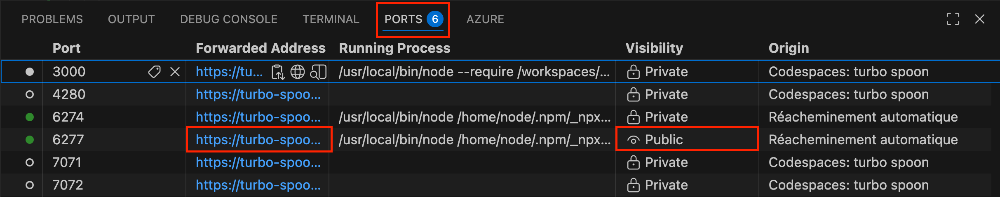
>
> Finally, use the same terminal to start the MCP Inspector command.

</div>

Run this command to start the MCP Inspector:

```bash
npx -y @modelcontextprotocol/inspector
```

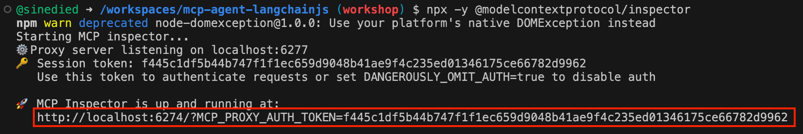

Open the URL shown in the console in your browser **using Ctrl+Click (or Cmd+Click on Mac)**, then configure the connection to your local MCP server:

If you're running this workshop

1. Set transport type to **Streamable HTTP**
2. Enter your local server URL: `http://localhost:3000/mcp`.
3. Click **Connect**

After you're connected, go to the **Tools** tab to list available tools. You can then try the `get_burgers` tool to see the burger menu.

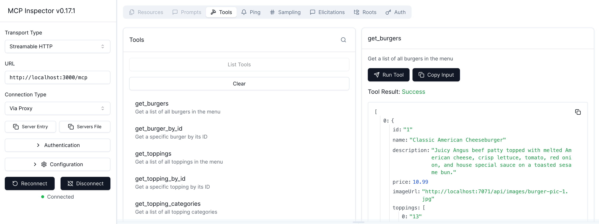

Try playing a bit with the other tools to check your implementation!

<div class="tip" data-title="tip">

> If you're having trouble connecting to your local MCP server from the MCP Inspector, make sure that:
> - The MCP server is running
> - The **Inspector Proxy Adress** under the **Configuration** tab of the MCP Inspector is empty if you're running locally, or set to the forwarded URL for port 6277 if you're running in Codespaces (you can run `echo "https://$CODESPACE_NAME-6277.$GITHUB_CODESPACES_PORT_FORWARDING_DOMAIN"` to get the correct URL or view it in the **Ports** tab of the VS Code bottom panel).

</div>

#### [optional] Using GitHub Copilot

GitHub Copilot is an AI agent compatible with MCP servers, so you can also use it to test your MCP server implementation.

Configure GitHub Copilot to use your deployed MCP server by adding this to your project's `.vscode/mcp.json`:

```json
{
  "servers": {
    "burger-mcp": {
      "type": "http",
      "url": "http://localhost:3000/mcp"
    }
  }
}
```

Click on the **Start** button that will appear in this JSON file to activate the MCP server connection.

Now you can open a Copilot chat window, set the agent mode and check that the `burger-mcp` server is available selected in the tools section.

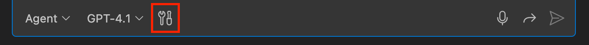

Try asking things like:
- *"What spicy burgers do you have?"*
- *"Place an order for two cheeseburgers"*
- *"Show my recent orders"*

Copilot will automatically discover and use the MCP tools! 🎉

<div class="tip" data-title="tip">

> If Copilot doesn't call the burger MCP tools, try checking if it's enabled by clicking on the tool icon in the chat input box and ensuring that "burger-mcp" is selected. You can also force tool usage by adding `#burger-mcp` in your prompt.

</div>

### [optional] Adding stdio transport support

It's possible to support both HTTP and stdio transports in the same MCP server implementation. This is useful if you want to be able to run the server both as a web service and as a local process communicating over stdio.

Running server locally with stdio transport is also a good approach if you have sensitive data that you don't want to expose over HTTP, like personal information or credentials.

We'll use a separate entry point for the stdio transport, so both transports can be started independently. Create a new file `src/local.ts` and add the following code:

```ts
import { StdioServerTransport } from '@modelcontextprotocol/sdk/server/stdio.js';
import { burgerApiUrl } from './config.js';
import { getMcpServer } from './mcp.js';

try {
  const server = getMcpServer();
  const transport = new StdioServerTransport();
  await server.connect(transport);
  console.error(`Burger MCP server running on stdio (Using burger API URL: ${burgerApiUrl})`);
} catch (error) {
  console.error('Error starting MCP server:', error);
  process.exitCode = 1;
}
```

As you can see, this is quite straightforward: we create a `StdioServerTransport` instance and connect it to the MCP server.

To run the MCP server with stdio transport, use the following command from the `packages/burger-mcp` folder:

```bash
npm run start:local
```

You can also test the stdio transport with GitHub Copilot by configuring the MCP server in `.vscode/mcp.json` like this:

```json
{
  "servers": {
    "burger-mcp": {
      "type": "stdio",
      "command": "npm",
      "args": ["run", "start:local", "--workspace=burger-mcp"]
    }
  }
}
```


---

## Agent API

With our MCP server up and running, it's time to build our AI agent using LangChain.js. We'll also create an API endpoint that our frontend can call to chat with the agent.

### About LangChain.js

There are many frameworks available to build AI agents, but for this workshop we'll use [LangChain.js](https://docs.langchain.com/oss/javascript/langchain/overview). It's one of the most popular JS frameworks for building applications with LLMs, with a huge community of developers. Since its v1.0 release, it's now an agent-first framework making it a perfect fit for our use case.

The benefits of using LangChain.js are numerous:
- It provides a simple and consistent API to interact with different LLM providers, allowing to switch and try different models with minimal code changes.
- It has first-class support for building agents, while streaming all intermediate steps for creating dynamic UI experiences.
- It supports a wide range of tools and integrations, including MCP, vector databases, APIs, and more.
- The [LangGraph.js](https://docs.langchain.com/oss/javascript/langgraph/overview) companion library gives you full control over your agents behavior when needed, with support for multi-agents orchestration and advanced workflows.

### Introducting Azure Functions

We'll use [Azure Functions](https://learn.microsoft.com/azure/azure-functions/functions-overview?pivots=programming-language-javascript) to host the web API for ou Agent. Azure Functions is a serverless compute service that enables you to scale on-demand without having to manage infrastructure. It's a great fit for JS applications, and now even support hosting full Node.js applications, like our MCP server.

#### Creating the HTTP function

Let's bootstrap our chat API endpoint, that will be used to interact with our AI agent. Open the file `src/functions/chat-post.ts` and add this code:

```ts
import { HttpRequest, InvocationContext, HttpResponseInit, app } from '@azure/functions';
import { type AIChatCompletionRequest, type AIChatCompletionDelta } from '../models.js';

export async function postChats(request: HttpRequest, context: InvocationContext): Promise<HttpResponseInit> {

  // TODO: implement chat endpoint

}

app.setup({ enableHttpStream: true });
app.http('chats-post', {
  route: 'chats/stream',
  methods: ['POST'],
  authLevel: 'anonymous',
  handler: postChats,
});
```

Here we're using the Azure Functions SDK to create an HTTP-triggered function. this bootstraping code is similar to what you would do with other frameworks like Express or Fastify:

1. We create the function that will implement the chat endpoint logic, named `postChats`.
2. We use the `app.http` method to define the HTTP endpoint, specifying the route, the supported HTTP methods, if the endpoint needs authentication (`anonymous` means that it's publicly available to any user), and the handler function.
3. As we're going to stream the Agent responses, we need to toggle a special option to enable HTTP streaming with `{ enableHttpStream: true }`.

You might have noticed in the imports that we already have defined some models that we'll use for our request and response:
- `AIChatCompletionRequest`: defines the shape of the request body that our endpoint will receive.
- `AIChatCompletionDelta`: defines the shape of the response chunks that our endpoint will stream back to the client.

These models correspond to the specifiction we saw earlier in the **Overview** section.

#### Completing the boilerplate

Before we can focus on the agent implementation let's get the boilerplate code out of the way. We'll add basic checks and error handling to our endpoint.

Replace the `postChats` function with this code:

```ts
export async function postChats(request: HttpRequest, context: InvocationContext): Promise<HttpResponseInit> {
  const azureOpenAiEndpoint = process.env.AZURE_OPENAI_API_ENDPOINT;
  const burgerMcpUrl = process.env.BURGER_MCP_URL ?? 'http://localhost:3000/mcp';

  try {
    const requestBody = (await request.json()) as AIChatCompletionRequest;
    const { messages } = requestBody;

    const userId = process.env.USER_ID ?? requestBody?.context?.userId;
    if (!userId) {
      return {
        status: 400,
        jsonBody: {
          error: 'Invalid or missing userId in the environment variables',
        },
      };
    }

    if (messages?.length === 0 || !messages.at(-1)?.content) {
      return {
        status: 400,
        jsonBody: {
          error: 'Invalid or missing messages in the request body',
        },
      };
    }

    if (!azureOpenAiEndpoint || !burgerMcpUrl) {
      const errorMessage = 'Missing required environment variables: AZURE_OPENAI_API_ENDPOINT or BURGER_MCP_URL';
      context.error(errorMessage);
      return {
        status: 500,
        jsonBody: {
          error: errorMessage,
        },
      };
    }

    // TODO: Implement the AI agent here

  } catch (_error: unknown) {
    const error = _error as Error;
    context.error(`Error when processing chat-post request: ${error.message}`);

    return {
      status: 500,
      jsonBody: {
        error: 'Internal server error while processing the request',
      },
    };
  }
}
```

As you can see, we simply added validation for environment variables and the request input, and wrapped everything in a try/catch block to handle any unexpected errors.

### Implementing the AI agent

Now we can start coding our AI agent! Let's start by initializing our LLM model using LangChain.js. Add this import at the top of the file:

```ts
import { ChatOpenAI } from '@langchain/openai';
```

Then, inside the `postChats` function, add this code after the `// TODO: Implement the AI agent here` comment: 

```ts
    const model = new ChatOpenAI({
      configuration: { baseURL: azureOpenAiEndpoint },
      modelName: process.env.AZURE_OPENAI_MODEL ?? 'gpt-5-mini',
      streaming: true,
      apiKey: getAzureOpenAiTokenProvider(),
    });
```

<!-- TODO: test ollama responses api -->

#### Managing Azure credentials

Now we need to handle the authentication part and implement the `getAzureOpenAiTokenProvider` function.

To allow connecting to Azure OpenAI without having to manage secrets, we'll use the [Azure Identity SDK](https://learn.microsoft.com/javascript/api/overview/azure/identity-readme?view=azure-node-latest) to retrieve an access token using the current user identity.

Add this import at the top of the file:

```ts
import { DefaultAzureCredential, getBearerTokenProvider } from '@azure/identity';
```

Then add this at the bottom of the file:

```ts
function getAzureOpenAiTokenProvider() {
  // Automatically find and use the current user identity
  const credentials = new DefaultAzureCredential();

  // Set up token provider
  const getToken = getBearerTokenProvider(credentials, 'https://cognitiveservices.azure.com/.default');
  return async () => {
    try {
      return await getToken();
    } catch {
      // When using Ollama or an external OpenAI proxy,
      // Azure identity is not supported, so we use a dummy key instead.
      console.warn('Failed to get Azure OpenAI token, using dummy key');
      return '__dummy';
    }
  };
}
```

This will use the current user identity to authenticate with Azure OpenAI. We don't need to provide any secrets, just use `az login` (or `azd auth login`) locally, and [managed identity](https://learn.microsoft.com/entra/identity/managed-identities-azure-resources/overview) when deployed on Azure.

#### Connecting to the MCP server

The next step is to connect to our Burger MCP server and load the tools we need for our agent. Add this import at the top of the file:

```ts
import { MultiServerMCPClient } from "@langchain/mcp-adapters";
```

Next, continue the code inside the `postChats` function after the model initialization:

```ts
    context.log(`Connecting to Burger MCP server at ${burgerMcpUrl}`);
    const client = new MultiServerMCPClient({
      burger: {
        transport: 'http',
        url: burgerMcpUrl,
      },
    });

    const tools = await client.getTools();
    context.log(`Loaded ${tools.length} tools from Burger MCP server`);
```

Here we're first creating an MCP client and connecting it to our Burger MCP server using HTTP. Note that the `MultiServerMCPClient` supports connecting to multiple MCP servers and mixing different transports if needeed. By default, it works with **stateless connections** and needs some additional configuration to support **stateful servers** (see the [LangChain.js MCP documentation](https://docs.langchain.com/oss/javascript/langchain/mcp) for more details).

After the connection is established, we use `getTools` to load all the tools exposed by the MCP server in a LangChain.js compatible format.

#### Creating the system prompt

The last thing we need to do before creating the agent is to define the system prompt that will set the context for our agent. Don't overlook this step, as this is the most important part of the agent behavior!

Add this code after the imports:

```ts
const agentSystemPrompt = `## Role
You an expert assistant that helps users with managing burger orders. Use the provided tools to get the information you need and perform actions on behalf of the user.
Only answer to requests that are related to burger orders and the menu. If the user asks for something else, politely inform them that you can only assist with burger orders.
Be conversational and friendly, like a real person would be, but keep your answers concise and to the point.

## Context
The restaurant is called Contoso Burgers. Contoso Burgets always provides french fries and a fountain drink with every burger order, so there's no need to add them to orders.

## Task
1. Help the user with their request, ask any clarifying questions if needed.

## Instructions
- Always use the tools provided to get the information requested or perform any actions
- If you get any errors when trying to use a tool that does not seem related to missing parameters, try again
- If you cannot get the information needed to answer the user's question or perform the specified action, inform the user that you are unable to do so. Never make up information.
- The get_burger tool can help you get informations about the burgers
- Creating or cancelling an order requires the userId, which is provided in the request context. Never ask the user for it or confirm it in your responses.
- Use GFM markdown formatting in your responses, to make your answers easy to read and visually appealing. You can use tables, headings, bullet points, bold text, italics, images, and links where appropriate.
- Only use image links from the menu data, do not make up image URLs.
- When using images in answers, use tables if you are showing multiple images in a list, to make the layout cleaner. Otherwise, try using a single image at the bottom of your answer.
`;
```

As you can see, this prompt is quite detailed. We'll break it down to understand the different parts:
- **Role**: we define the role of the agent, what it is supposed to do/not do and the tone it should use. Role-playing is a powerful technique to guide an LLM behavior, and has been shown to improve results significantly.

- **Context**: we provide additional context about the restaurant and its policies. This **grounds the agent** in the specific domain of our company, and provide the necessary background information and data (like the fact that fries and drinks are included with every order) that the burger API does not provide directly.

- **Task**: we define the main task of the agent, which is to help the user with their requests. This can be a multiple-step task, here we just keep it simple.

- **Instructions**: we provide a set of instructions to guide the agent behavior, can clarify, fine-tune, and constrain its actions. Some important instructions here are:
  * `Always use the provided tools to get information or perform actions`: this ensures that the agent relies on the tools we provided via MCP, and does not try to answer questions on its own. We also give it an example usage with the `get_burger` tool, and explicitly tell it to retry if it gets errors.
  * `If you cannot get the information needed...`: this is **a very important instruction to avoid hallucinations**, called an *escape hatch*. It tells the agent to inform the user if it cannot fulfill their request, instead of making up information.
  * `Creating or cancelling an order requires the userId...`: this instruction is specific to our use case, as we will provide the `userId` via the request context. This prevents the agent from asking for it, which might be confusing for the user.
  * We also provide detailed instructions on how to format the answers using markdown, including images. This kind of formatting can be tuned to fit your frontend needs.

<div class="tip" data-title="Tip">

> Crafting good prompts is an iterative process. You should test and tweak the prompt as you go, to get the best results for your specific use case. Instructions that work well for one domain may not be optimal for another, so don't hesitate to experiment! This is outside the scope of this workshop, but you can use tools like [Promptfoo](https://github.com/promptfoo/promptfoo) to help you evaluate your prompts and compare different versions.

</div>

When working with agents, the prompt crafting process is called *context engineering*, and it's a key skill to master when building AI applications. It's also a bit different than what we call *prompt engineering*: prompt engineering is more focused on **how** to write the prompt (formatting, structure, wording etc.), while context engineering is more about **what** to include in the prompt to provide the necessary context for the agent to perform its task effectively, without overloading it with unnecessary information.

#### Creating the agent

We have the LLM, the tools and the prompt: it's time to create the agent!

Add this import:

```ts
import { createAgent, AIMessage, HumanMessage } from 'langchain';
```

Then again, continue the code inside the `postChats` function after loading the tools:

```ts
    const agent = createAgent({
      model,
      tools,
      systemPrompt: agentSystemPrompt,
    });
```

Seems pretty straightforward, right? We just call the `createAgent` function, passing the model, the tools and the system prompt we created earlier.

While simple on the surface, this creates a *ReAct* (Reasoning + Acting) agent that decide which tools to use, and iteratively work towards solutions.

You have have the option to customize the agent behavior with **middlewares**, that can dynamically modify, extend or hook into the agent execution flow.

Middlewares can for example be used to:
- Add human-in-the-loop capabilities, to allow a human to review and approve tool calls before they are executed
- Add pre/post model and tool processing for context injection or validation, for security or compliance purposes
- Add dynamic control flows, to automatically retry failed tool calls, or branch the execution based on certain conditions

Our use case is simple enough that we don't need any middlewares, but you can read more about them in the [LangChain.js documentation](https://docs.langchain.com/oss/javascript/langchain/middleware/overview).

#### Generating the response

Before we can call the agent to generate the response, we need to convert the messages we received in the request to the format expected by LangChain.js. Add this code after the agent creation:

```ts
    const lcMessages = messages.map((m) =>
      m.role === 'user' ? new HumanMessage(m.content) : new AIMessage(m.content),
    );
```

Now we can call the agent to generate the response. Add this code below:

```ts
    // Start the agent and stream the response events
    const responseStream = agent.streamEvents(
      {
        messages: [
          new HumanMessage(`userId: ${userId}`),
          ...lcMessages],
      },
      { version: 'v2' },
    );
```

<div class="info" data-title="note">

> LangChain.js supports different way of streaming the responses. Here we use the `streamEvents` method, which returns all the agents steps as series of events that you can filter and process as needed. There's also a `stream` method, which you can configure to receive specific updates. Using `streamEvents` gives us more flexibility and control over the response handling.

</div>

Let's complete the `postChats` function by returning the response stream to the client. Add this import at the top of the file:

```ts
import { Readable } from 'node:stream';
import { StreamEvent } from '@langchain/core/tracers/log_stream';
```

And complete the `postChats` function after the response stream creation:

```ts
    // Convert the LangChain stream into a Readable stream of JSON chunks
    const jsonStream = Readable.from(createJsonStream(responseStream));

    return {
      headers: {
        // This content type is needed for streaming responses
        // from an Azure Static Web Apps linked backend API
        'Content-Type': 'text/event-stream',
        'Transfer-Encoding': 'chunked',
      },
      body: jsonStream,
    };
```

The `Readable.from()` methods allows us to create a Node.js stream from an [async generator function](https://developer.mozilla.org/docs/Web/JavaScript/Reference/Global_Objects/AsyncGenerator). We also need to further process the response stream to convert it to a JSON format compatible with our frontend, so we call a helper function named `createJsonStream` that we'll implement next.

Finally, we return the HTTP response with the appropriate headers for streaming, and the body set to our JSON stream.

#### Filtering and formatting the event stream

Now it's time to implement the `createJsonStream` function. Add this code at the bottom of the file:

```ts
// Transform the response chunks into a JSON stream
async function* createJsonStream(chunks: AsyncIterable<StreamEvent>) {
  for await (const chunk of chunks) {
    const { data } = chunk;
    let responseChunk: AIChatCompletionDelta | undefined;

    if (chunk.event === 'on_chat_model_stream' && data.chunk.content.length > 0) {
      // LLM is streaming the final response
      responseChunk = {
        delta: {
          content: data.chunk.content[0].text ?? data.chunk.content,
          role: 'assistant',
        },
      };
    } else if (chunk.event === 'on_chat_model_start') {
      // Start of a new LLM call
      responseChunk = {
        delta: {
          context: {
            currentStep: {
              type: 'llm',
              name: chunk.name,
              input: data?.input ?? undefined,
            },
          },
        },
      };
    } else if (chunk.event === 'on_tool_start') {
      // Start of a new tool call
      responseChunk = {
        delta: {
          context: {
            currentStep: {
              type: 'tool',
              name: chunk.name,
              input: data?.input?.input ? JSON.stringify(data.input?.input) : undefined,
            },
          },
        },
      };
    }

    if (!responseChunk) {
      continue;
    }

    // Format response chunks in Newline delimited JSON
    // see https://github.com/ndjson/ndjson-spec
    yield JSON.stringify(responseChunk) + '\n';
  }
}
```

The event stream from LangChain.js contains different kinds of events, and not all of them relevant for our use case. They're sent as chunks that contain an `event` type and associated `data`.

Here we're catching and processing kinds of events from the response chunk:

1. **on_chat_model_stream**: this event is sent when the LLM is streaming tokens, ie the final response. We format it as a chat message delta.

2. **on_chat_model_start**: this event is sent when the agent starts a new LLM call. We format it as a context delta with the current step information.

3. **on_tool_start**: this event is sent when the agent starts a new tool call. We format it as a context delta with the current step information.

<div class="info" data-title="note">

> You may have notices the `async function*` syntax used to define the `createJsonStream` function.
> This is an [async generator function](https://developer.mozilla.org/docs/Web/JavaScript/Reference/Global_Objects/AsyncGenerator), which allows us to `yield` values asynchronously. The `yield` keyword allows for the function to return multiple values over time, building up a stream of data.

</div>

There are many more events that you can hook into, you can try adding a `console.log({ chunk });` at the beginning of the `for await` loop to see all the events being sent by the agent.

### Testing our API

Make sure your Burger MCP server is still running locally, then open a terminal and start the agent API with:

```bash
cd packages/agent-api
npm start
```

This will start the Azure Functions runtime and host our agent API locally at `http://localhost:7072`. You should see this in the terminal when it's ready:

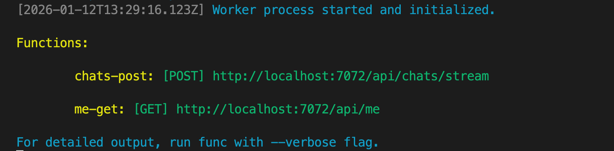

#### Option 1: Using the REST Client extension

This is the easiest way to test our API. If you don't have it yet, install the [REST Client](https://marketplace.visualstudio.com/items?itemName=humao.rest-client) extension for VS Code.

Open the file `packages/agent-api/api.http` file. Go to the "Chat with the agent" comment and hit the **Send Request** button below to test the API.

You can play a bit and edit the question to see how the agent behaves.

#### Option 2: Using cURL

Open up a new terminal in VS Code, and run the following commands:
  
```bash
curl -N -sS -X POST "http://localhost:7072/api/chats/stream" \
  -H "Content-Type: application/json" \
  -d '{
    "messages": [{
      "content": "Do you have spicy burgers?",
      "role": "user"
    }]
  }'
```

You can play a bit and change the question to see how the agent behaves.

### [Optional] Debugging your agent with traces

As you're playing with your agent, you might want to see more details about its internal workings, like which tools it called, what were the inputs and outputs, and so on. This is especially useful when you're trying to debug or improve your agent's behavior.

There are various ways to achieve this, but one of the most effective methods is to use tracing. We'll use [OpenTelemetry](https://opentelemetry.io), one of the most popular open-source observability frameworks, to instrument our agent and collect traces. LangChain.js does not have a built-in support for OpenTelemetry, but the community package [@arizeai/openinference-instrumentation-langchain](https://www.npmjs.com/package/@arizeai/openinference-instrumentation-langchain) fills this gap nicely.

We've already set up OpenTelemetry in our project, so all we need to do is enable the LangChain.js instrumentation in our agent API. You can open the file `packages/agent-api/src/tracing.ts` to have a quick look at how we configured it.

When running the server locally, we detect if there's an OpenTelemetry collector running at `http://localhost:4318`, and send the traces there.

#### OpenTelemetry collector in AI Toolkit

The [AI Toolkit for Visual Studio Code](https://code.visualstudio.com/docs/intelligentapps/overview) extension provides a great way to visualize and explore OpenTelemetry traces directly within VS Code. If you don't have it yet, install this extension by following the link.

<div class="important" data-title="Important">

> The tracing features in AI Toolkit are currently only available when running VS Code locally on your machine. They are not supported when using GitHub Codespaces.

</div>

Select the AI Toolkit icon in the VS Code sidebar, then go to the **Tracing** tool, located under the **Agent and Workflow Tools** section:

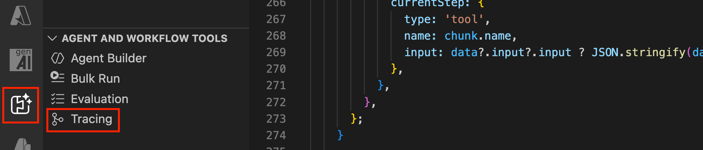

Click on the **Start Collector** button to launch a local OpenTelemetry collector, then make some requests to your agent API using one of the methods described earlier.

You should start seeing traces appearing in table:

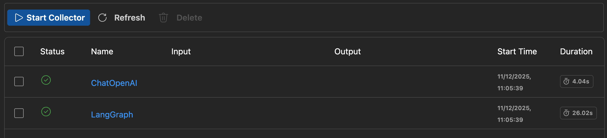

Select the "LangGraph" trace to see the details of the agent execution, including the tool calls and LLM interactions. You can expand each span to see more details, like the inputs and outputs, and any errors that might have occurred.

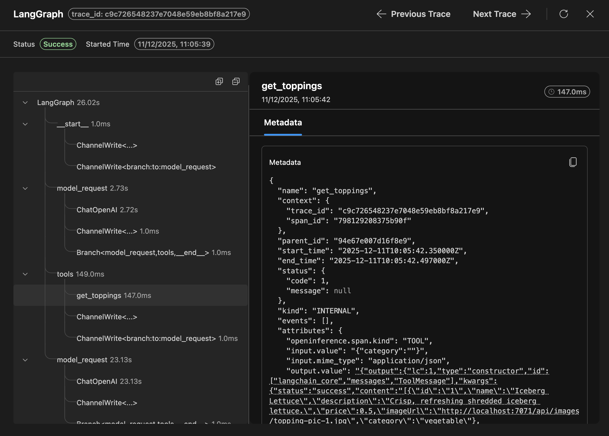


---

<div class="info" data-title="Skip notice">

> If you want to skip the Chat website implementation and jump directly to the next section, run this command in the terminal **at the root of the project** to get the completed code directly:
> ```bash
> curl -fsSL https://github.com/Azure-Samples/mcp-agent-langchainjs/releases/download/latest/agent-webapp.tar.gz | tar -xvz
> ```

<div>

## Agent website

Now that we have our Agent API, it's time to complete the website that will use it.

### Introducing Vite and Lit

We'll use [Vite](https://vitejs.dev/) as a frontend build tool, and [Lit](https://lit.dev/) as a Web components library.

This frontend will be built as a Single Page Application (SPA), which will be similar to the well-known ChatGPT website. The main difference is that it will get its reponse from the Agent API that we built in the previous section.

The project is available in the `packages/agent-webapp` folder. From the project directory, you can run this command to start the development server:

```bash
cd packages/agent-webapp
npm run start
```

This will start the application in development mode using the [Azure Static Web Apps CLI](https://learn.microsoft.com/azure/static-web-apps/static-web-apps-cli-overview) . Click on [http://localhost:4280](http://localhost:4280) in the console to view it in the browser.

<div class="important" data-title="important">

> In Codespaces, since the machine you're working on is remote, you need to use the forwarded port URL to access it in your browser.
> You can find it in the **Ports** tab of the bottom panel. Right click on the URL in the **Forwarded Address** column next to the `4280` port, and select **Open in browser**.

</div>

<div class="tip" data-title="Tip">

> In development mode, the Web page will automatically reload when you make any change to the code. We recommend you to keep this command running in the background, and then have two windows side-by-side: one with your IDE where you will edit the code, and one with your Web browser where you can see the final result.

</div>

### The chat web component

We already built a chat web component for you, so you can focus on connecting the chat API. The nice thing about web components is that they are just HTML elements, so you can use them in any framework, or even without a framework, just like we do in this workshop.

As a result, you can re-use this component in your own projects, and customize it if needed.

The component is located in the `src/components/chat.ts` file, if you're curious about how it works.

If you want to customize the component, you can do it by editing the `src/components/chat.ts` file. The various HTML rendering methods are called `renderXxx`, for example here's the `renderLoader` method that is used to display the spinner while the answer is loading:

```ts
protected renderLoader = () =>
  this.isLoading && !this.isStreaming
    ? html`
        <div class="message assistant loader">
          <div class="message-body">
            ${this.currentStep ? html`<div class="current-step">${this.getCurrentStepTitle()}</div>` : nothing}
            <slot name="loader"><div class="loader-animation"></div></slot>
            <div class="message-role">${this.options.strings.assistant}</div>
          </div>
        </div>
      `
    : nothing;
```

### Calling the agent API

Now we need to call the agent API we created earlier. For this, we need to edit the `src/api.ts` file and complete the code where the  `TODO` comment is:

```ts
// TODO: complete call to the agent API
// const response =
```

Here you can use the [Fetch Web API](https://developer.mozilla.org/docs/Web/API/Fetch_API/Using_Fetch) to call your chat API. The URL of the API is already available in the `apiUrl` property.

In the body of the request, you should pass a JSON string containing the messages located in the `options.messages` property.

Now it's your turn to complete the code! 🙂

We'll handle the errors and parsing of the stream response after, so for now just focus on sending the request.

<details>
<summary>Click here to see an example solution</summary>

```ts
  const response = await fetch(`${apiUrl}/api/chats/stream`, {
    method: 'POST',
    headers: { 'Content-Type': 'application/json' },
    body: JSON.stringify({
      messages: options.messages,
      context: options.context || {},
    }),
  });
```

</details>

This method will be called from the Web component, in the `onSendClicked` method.

### Handling errors

We have the API call ready, but we still need to handle errors. For example, if the API is not reachable, or if it returns an error status code.

To do this, we can check the `response.ok` property after the fetch call, and the HTTP status code in the `response.status` property.

Add the following code after the fetch call to handle errors:

```ts
  if (response.status > 299 || !response.ok) {
    let json: JSON | undefined;
    try {
      json = await response.json();
    } catch {}

    const error = json?.['error'] ?? response.statusText;
    throw new Error(error);
  }
```

If we get an error, we still try to parse the response body as JSON to get a more detailed error message. If that fails, we just use the status text as the error message.

### Parsing the streaming response

Now that we have the error handling in place, we need parse the streaming response from the API. Streamed HTTP responses are a bit different that plain JSON responses, because the data is sent in chunks that can split during the transport and buffering, so we need to re-assemble them before we can parse the JSON.

Let's complete the `getCompletion()` first, we'll take care of the streaming after that.

Add this code after the error handling:

```ts
  return getChunksFromResponse<AIChatCompletionDelta>(response);
```

#### Parsing the stream

Now we'll implement the `getChunksFromResponse` function to turn the stream into a series of JSON objects.

Add this function at the bottom of the `src/api.ts` file:

```ts
export async function* getChunksFromResponse<T>(response: Response): AsyncGenerator<T, void> {
  const reader = response.body?.pipeThrough(new TextDecoderStream()).pipeThrough(new NdJsonParserStream()).getReader();
  if (!reader) {
    throw new Error('No response body or body is not readable');
  }

  let value: JSON | undefined;
  let done: boolean;
  // eslint-disable-next-line no-await-in-loop
  while ((({ value, done } = await reader.read()), !done)) {
    const chunk = value as T;
    yield chunk;
  }
}
```

Let's break down what this function does:
1. First, notice that we're using an async generator function again, so we can yield multiple values over time and create our stream of JSON objects.
2. We use the stream transform API to first decode the response body as text, and then parse it as NDJSON (Newline Delimited JSON). Since there's no built-in NDJSON parser in the browser, we'll implement our own after this.
3. We get a reader from the transformed stream, and read the value it returns (the JSON chunks). Finally, we yield each chunk converted to the type we expect, in our case `AIChatCompletionDelta`.

#### Implementing the NDJSON transformer

The last piece of the puzzle is to implement the `NdJsonParserStream` class that will transform a stream of text into a stream of JSON objects.

Add this class before the `getChunksFromResponse` function:

```ts
class NdJsonParserStream extends TransformStream<string, JSON> {
  private buffer = '';
  constructor() {
    let controller: TransformStreamDefaultController<JSON>;
    super({
      start(_controller) {
        controller = _controller;
      },
      transform: (chunk) => {
        const jsonChunks = chunk.split('\n').filter(Boolean);
        for (const jsonChunk of jsonChunks) {
          try {
            this.buffer += jsonChunk;
            controller.enqueue(JSON.parse(this.buffer));
            this.buffer = '';
          } catch {
            // Invalid JSON, wait for next chunk
          }
        }
      },
    });
  }
}
```

This class extends the `TransformStream` interface, to transform text (`string`) into JSON. The important part here is the `transform` method, which is called for each chunk of text received.

Because the chunks can be split in the middle of a JSON object, we need to buffer the incoming text until we can parse a complete JSON object. NDJSON objects are separated by newlines, so we split the incoming text by `\n`, and recombine each pice until we can successfully parse a JSON object. We emit the resulting object, clear the buffer and continue.

### Testing the completed website

Keep the webapp server running, and make sure that your agent API and MCP server are also running.

You can now open [http://localhost:4280](http://localhost:4280) in your browser to see the chat website, and try sending questions to your agent.

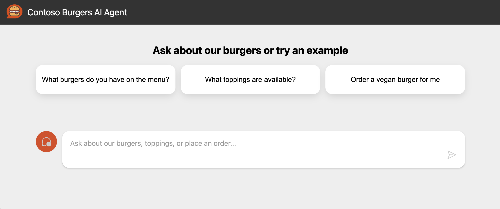

If everything is working correctly, you should see the agent answering alternating between "Thinking...", tools calls, beforing finally giving the final answer.

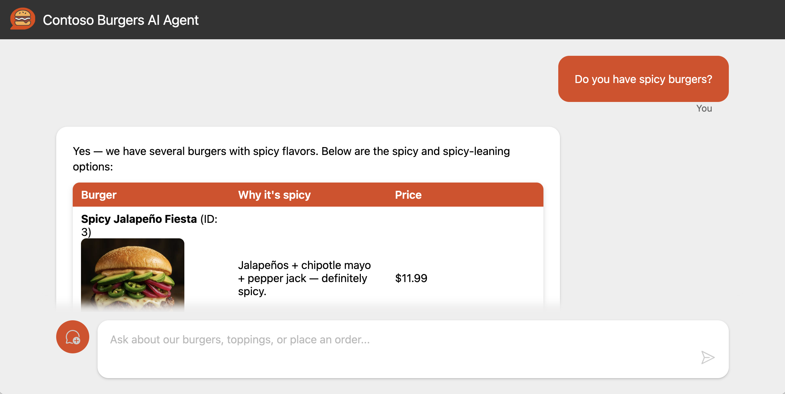


---

## Azure setup

[Azure](https://azure.microsoft.com) is Microsoft's comprehensive cloud platform, offering a vast array of services to build, deploy, and manage applications across a global network of Microsoft-managed data centers. In this workshop, we'll leverage several Azure services to run our chat application.

### Getting started with Azure

To complete this part, you'll need an Azure account. If you don't already have one, you can sign up for a free account, which includes Azure credits, on the [Azure website](https://aka.ms/devrelft).

<div class="important" data-title="important">

> If you already have an Azure account from your company, make sure to check with your administrator that you have sufficient permissions to create resources and assign system roles (more details in the [prerequisites](?step=0#prerequisites) section).

</div>

### Configure your project and deploy infrastructure

Before we dive into the details, let's set up the Azure resources needed for this workshop. This initial setup may take a few minutes, so it's best to start now. We'll be using the [Azure Developer CLI](https://learn.microsoft.com/azure/developer/azure-developer-cli/), a tool designed to streamline the creation and management of Azure resources.

#### Log in to Azure

Begin by logging into your Azure subscription with the following command:

```sh
azd auth login --use-device-code
```

This command will provide you a *device code* to enter in a browser window. Follow the prompts until you're notified of a successful login.

#### Create a new environment

Next, set up a new environment. The Azure Developer CLI uses environments to manage settings and resources:

```sh
azd env new mcp-agent-workshop
```

<div data-visible="$$proxy$$">

As we have deployed an OpenAI service for you, run this command to set the OpenAI URL we want to use:

```sh
azd env set AZURE_OPENAI_ALT_ENDPOINT $$proxy$$
```

</div>

<div class="important" data-title="Important">

> If you're using an Azure for Students or Free Trial account that you just created, you need to run the following command:
> ```sh
> azd env set AZURE_OPENAI_MODEL_CAPACITY 1
> ```
> This ensures that the resources deployed will fit within the free tier limits. **This limitations reduce the capacity for AI models usage, so you'll also have to provide another OpenAI endpoint to use the application properly.** To do that, use the following commands to set the OpenAI endpoint, API key and model you want to use:
> ```sh
> azd env set AZURE_OPENAI_ALT_ENDPOINT <your_openai_endpoint>
> azd env set AZURE_OPENAI_API_KEY <your_openai_api_key>
> azd env set AZURE_OPENAI_MODEL <your_openai_model>
> ```
> You can for example use the free [GitHub Models](https://docs.github.com/github-models/use-github-models/prototyping-with-ai-models#experimenting-with-ai-models-using-the-api) for this, or any other OpenAI compatible endpoint.

</div>

#### Deploy Azure infrastructure

Now it's time to deploy the Azure infrastructure for the workshop. Execute the following command:

```sh
azd provision
```

You will be prompted to select an Azure subscription and a deployment region. It's generally best to choose a region closest to your user base for optimal performance, but for this workshop, choose `North Europe` or `East US 2` depending of which one is the closest to you.

<div class="info" data-title="Note">

> Some Azure services, such as Azure OpenAI, have [limited regional availability](https://azure.microsoft.com/explore/global-infrastructure/products-by-region/?products=cognitive-services,search&regions=non-regional,europe-north,europe-west,france-central,france-south,us-central,us-east,us-east-2,us-north-central,us-south-central,us-west-central,us-west,us-west-2,us-west-3,asia-pacific-east,asia-pacific-southeast). If you're unsure which region to select, _East US 2_ and _North Europe_ are typically safe choices as they support a wide range of services.

</div>

After your infrastructure is deployed, run this command:

```bash
azd env get-values > .env
```

This will create a `.env` file at the root of your repository, containing the environment variables needed to connect to your Azure services.

As this file may sometimes contains application secrets, it's a best practice to keep it safe and not commit it to your repository. We already added it to the `.gitignore` file, so you don't have to worry about it.

At this stage, if you go to the Azure Portal at [portal.azure.com](https://portal.azure.com) you should see something similar to this:

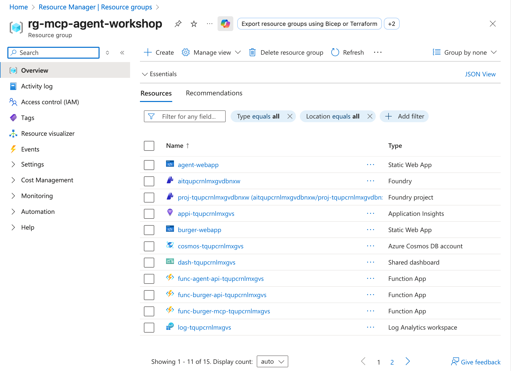

We need to run an additional command to log in to Azure using the Azure CLI, to ensure you have a valid identity when testing the application locally:

```sh
az login
```

### Introducing Azure services

In our journey to deploy the chat application, we'll be utilizing a suite of Azure services, each playing a crucial role in the application's architecture and performance.

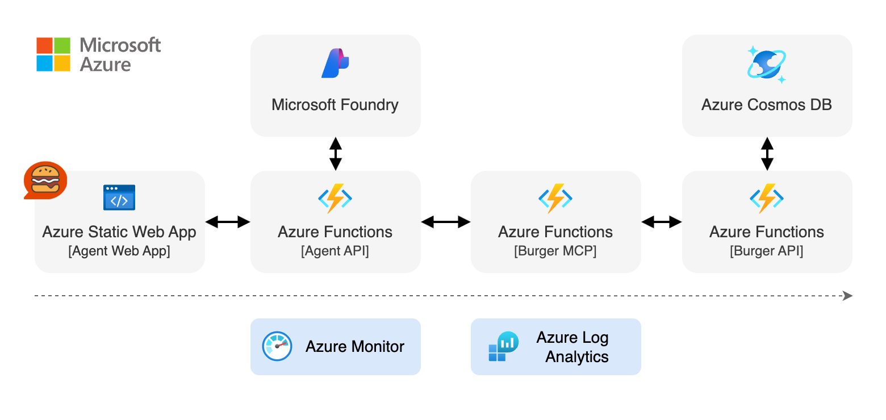

Here's a brief overview of the Azure services we'll use:

| Service | Purpose |
| ------- | ------- |
| [Azure Functions](https://learn.microsoft.com/azure/functions/) | Hosts our Node.js MCP server and API endpoints with on-demand  scaling and pricing. |
| [Azure Static Web Apps](https://learn.microsoft.com/azure/static-web-apps/) | Serves our agent web chat with integrated authentication, and global distribution. |
| [Azure Cosmos DB](https://learn.microsoft.com/azure/cosmos-db/) | A globally distributed, multi-model database service used to store user, burger and order data. |
| [Microsoft Foundry](https://learn.microsoft.com/azure/ai-foundry/) | Unified AI platform that we use to run the Azure OpenAI model powering our agent. |
| [Azure Log Analytics](https://learn.microsoft.com/azure/log-analytics/) | Collects and analyzes telemetry and logs for insights into application performance and diagnostics. |
| [Azure Monitor](https://learn.microsoft.com/azure/azure-monitor/) | Provides comprehensive monitoring of our applications, infrastructure, and network. |

While Azure Log Analytics and Azure Monitor aren't depicted in the initial diagram, they're integral to our application's observability, allowing us to troubleshoot and ensure our application is running optimally.

#### About Azure Functions

[Azure Functions](https://learn.microsoft.com/azure/functions/) is our primary service for running the backend services of our agent application. It's a serverless hosting service that abstracts away the underlying infrastructure, enabling us to focus on writing and deploying code.

Key features of Azure Functions include:

- **Serverless scaling**: Automatically scales up or down, even to zero, to match demand.
- **Event-driven**: Can be triggered by various events, such as HTTP requests, timers, or messages from other Azure services.
- **Multiple language support**: Supports various programming languages, including JavaScript and Node.js. 

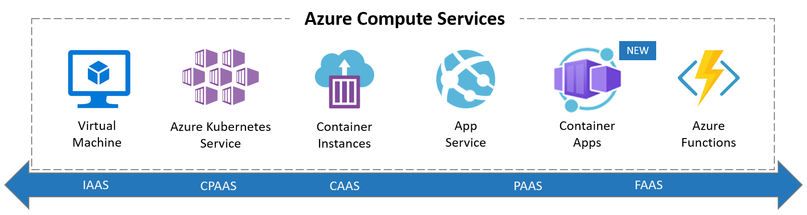

With the recent introduction of [Azure Flex Functions](https://learn.microsoft.com/azure/azure-functions/flex-consumption-plan), some of the limitations of traditional serverless functions like cold starts and the restriction to functions apps can be lifted easily. Like with the Burger MCP service, you can now **host full Node.js applications** on Azure Functions without changing your code. The only requirement is to add a simple `host.json` file to your project, take a look at the `packages/burger-mcp/host.json` file.

### Creating the infrastructure

Now that we know what we'll be using, let's create the infrastructure we'll need for this workshop.

To set up our application, we can choose from various tools like the Azure CLI, Azure Portal, ARM templates, or even third-party tools like Terraform. All these tools interact with Azure's backbone, the [Azure Resource Manager (ARM) API](https://learn.microsoft.com/azure/azure-resource-manager/management/overview).

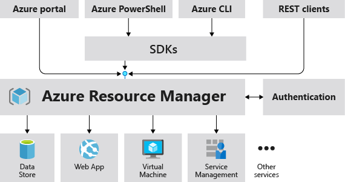

Any resource you create in Azure is part of a **resource group**. A resource group is a logical container that holds related resources for an Azure solution, just like a folder.

When we ran `azd provision`, it created a resource group named `rg-mcp-agent-workshop` and deployed all necessary infrastructure components using Infrastructure as Code (IaC) templates.

### Introducing Infrastructure as Code

Infrastructure as Code (IaC) is a practice that enables the management of infrastructure using configuration files. It ensures that our infrastructure deployment is repeatable and consistent, much like our application code. This code is committed to your project repository so you can use it to create, update, and delete your infrastructure as part of your CI/CD pipeline or locally.

There are many existing tools to manage your infrastructure as code, such as Terraform, Pulumi, or [Azure Resource Manager (ARM) templates](https://learn.microsoft.com/azure/azure-resource-manager/templates/overview). ARM templates are JSON files that allows you to define and configure Azure resources.

For this workshop, we're using [Bicep](https://learn.microsoft.com/azure/azure-resource-manager/bicep/overview?tabs=bicep), a language that simplifies the authoring of ARM templates.

#### What's Bicep?

Bicep is a Domain Specific Language (DSL) for deploying Azure resources declaratively. It's designed for clarity and simplicity, with a focus on ease of use and code reusability. It's a transparent abstraction over ARM templates, which means anything that can be done in an ARM Template can be done in Bicep.

Here's an example of a Bicep file that creates a Log Analytics workspace:

```bicep
resource logsWorkspace 'Microsoft.OperationalInsights/workspaces@2021-06-01' = {
  name: 'my-awesome-logs'
  location: 'westeurope'
  tags: {
    environment: 'production'
  }
  properties: {
    retentionInDays: 30
  }
}
```

A resource is made of differents parts. First, you have the `resource` keyword, followed by a symbolic name of the resource that you can use to reference that resource in other parts of the template. Next to it is a string with the resource type you want to create and API version.

<div class="info" data-title="note">

> The API version is important, as it defines the version of the template used for a resource type. Different API versions can have different properties or options, and may introduce breaking changes. By specifying the API version, you ensure that your template will work regardless of the product updates, making your infrastructure more resilient over time.

</div>

Inside the resource, you then specify the name of the resource, its location, and its properties. You can also add tags to your resources, which are key/value pairs that you can use to categorize and filter your resources.

Bicep templates can be modular, allowing for the reuse of code across different parts of your infrastructure. They can also accept parameters, making your infrastructure dynamically adaptable to different environments or conditions.

Explore the `./infra` directory to see how the Bicep files are structured for this workshop. The `main.bicep` file is the entry point, orchestrating the various modules that define our infrastructure. Most of the time, you don't need to write Bicep modules yourself, as you can find many pre-built modules in the [Azure Verified Modules library](https://azure.github.io/Azure-Verified-Modules/).

Bicep streamlines the template creation process, and you can get started with existing templates from the [Azure Quickstart Templates](https://github.com/Azure/azure-quickstart-templates/tree/master/quickstarts), use the [Bicep VS Code extension](https://marketplace.visualstudio.com/items?itemName=ms-azuretools.vscode-bicep) for assistance, or try out the [Bicep playground](https://aka.ms/bicepdemo) for converting between ARM and Bicep formats.


---

## Deploying to Azure

Our application is now ready to be deployed to Azure!

We'll use [Azure Static Web Apps](https://learn.microsoft.com/azure/static-web-apps/overview) to deploy the frontend, and [Azure Functions](https://learn.microsoft.com/azure/azure-functions/functions-overview) to deploy the different backend services (Agent API, Burger API and Burger MCP).

Run this command from the root of the project to build and deploy the application (this command deploys all services listed in the `azure.yaml` file located in the project root):

```bash
azd deploy
```

Once it's done, you should see the URL of the deployed frontend application in the output of the command.

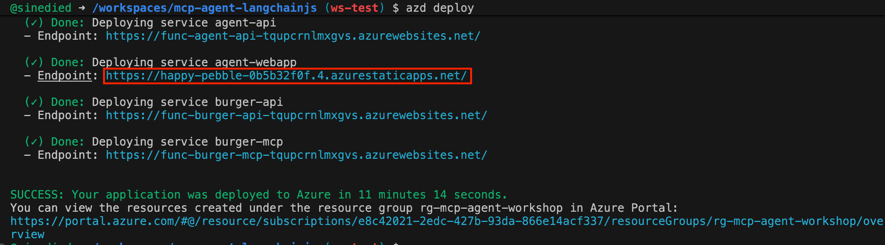

You can now open the agent webapp URL in a browser and test the deployed application.

<div class="important" data-title="Important" data-visible="$$burger_api$$">

You have to open the `<agent-webapp-url>/register` URL first to register your user ID before using the agent, since you're now using your Burger API with its own user database.

</div>

<div class="tip" data-title="Tip">

> You can also build and deploy the services separately by running `azd deploy <service_name>`.
>
> Even better! If you're starting from scratch and have a completed code, you can use the `azd up` command. This command combines both `azd provision` and `azd deploy` to provision the Azure resources and deploy the application in one command.

</div>


---

<div class="info" data-title="skip notice">

> This step is entirely optional, you can skip it if you want to jump directly to the next section.

</div>

## Configuring a CI/CD pipeline

We now have a working deployed application, but deploying it manually every time we make a change is not very convenient. We'll automate this process by creating a CI/CD pipeline, using [GitHub Actions](https://github.com/features/actions).

### What's CI/CD?

CI/CD stands for *Continuous Integration and Continuous Deployment*.

Continuous Integration is a software development practice that requires developers to integrate their code into a shared repository several times a day. Each integration can then be verified by an automated build and automated tests. By doing so, you can detect errors quickly, and locate them more easily.

Continuous Deployment pushes this practice further, by preparing for a release to production after each successful build. By doing so, you can get working software into the hands of users faster.

### What's GitHub Actions?

GitHub Actions is a service that lets you automate your software development workflows. A workflow is a series of steps executed one after the other. You can use workflows to build, test and deploy your code, but you can also use them to automate other tasks, like sending a notification when an issue is created.

It's a great way to automate your CI/CD pipelines, and it's free for public repositories.

### Adding the deployment workflow

First we need to create the GitHub Actions workflow. Create the file `.github/workflows/deploy.yaml` in your repository, with this content:

```yaml
name: Deploy to Azure
on:
  push:
    # Run when commits are pushed to mainline branch (main)
    # Set this to the mainline branch you are using
    branches: [main]

# Set up permissions for deploying with secretless Azure federated credentials
# https://learn.microsoft.com/azure/developer/github/connect-from-azure?tabs=azure-portal%2Clinux#set-up-azure-login-with-openid-connect-authentication
permissions:
  id-token: write
  contents: read

jobs:
  deploy:
    runs-on: ubuntu-latest
    env:
      AZURE_CLIENT_ID: ${{ vars.AZURE_CLIENT_ID }}
      AZURE_TENANT_ID: ${{ vars.AZURE_TENANT_ID }}
      AZURE_SUBSCRIPTION_ID: ${{ vars.AZURE_SUBSCRIPTION_ID }}
    steps:
      - name: Checkout
        uses: actions/checkout@v4

      - name: Install azd
        uses: Azure/setup-azd@v2

      - name: Install Nodejs
        uses: actions/setup-node@v4
        with:
          node-version: 22

      - name: Log in with Azure (Federated Credentials)
        if: ${{ env.AZURE_CLIENT_ID != '' }}
        run: |
          azd auth login `
            --client-id "$Env:AZURE_CLIENT_ID" `
            --federated-credential-provider "github" `
            --tenant-id "$Env:AZURE_TENANT_ID"
        shell: pwsh

      - name: Build and deploy application
        run: azd up --no-prompt
        env:
          AZURE_ENV_NAME: ${{ vars.AZURE_ENV_NAME }}
          AZURE_LOCATION: ${{ vars.AZURE_LOCATION }}
          AZURE_SUBSCRIPTION_ID: ${{ vars.AZURE_SUBSCRIPTION_ID }}
          AZURE_OPENAI_ALT_ENDPOINT: ${{ vars.AZURE_OPENAI_ALT_ENDPOINT }}
          AZURE_OPENAI_API_KEY: ${{ secrets.AZURE_OPENAI_API_KEY }}
          AZURE_OPENAI_MODEL: ${{ vars.AZURE_OPENAI_MODEL }}
```

This workflow will run when you push a commit change to the `main` branch of your repository. What it does is log in to Azure using the `azd auth login` command, and then run the `azd up` command to provision the infrastructure, build and deploy the application.

Next we need to configure your GitHub repository environment variables. These will be used by the workflow to authenticate to Azure. To do so, run this command:

```bash
azd pipeline config
```

You'll first be asked to log in to GitHub and then it will do the setup for you. These are the steps it will perform:
- Creation of an [Azure Service Principal](https://learn.microsoft.com/entra/identity-platform/app-objects-and-service-principals?tabs=browser) to authenticate to Azure.
- Set up OpenID Connect authentication between GitHub and Azure using [federated credentials](https://docs.github.com/actions/deployment/security-hardening-your-deployments/configuring-openid-connect-in-azure).
- Addition of [GitHub variables](https://docs.github.com/actions/learn-github-actions/variables) to your repository to store the IDs needed to authenticate to Azure.

<div data-visible="$$proxy$$">

Since you're using the provided Open AI proxy service we have deployed, there's one extra variable that you need to set.

First we need to log in to GitHub using the [GitHub CLI](https://cli.github.com/):

```bash
# We need more permissions than provided by default with Codespaces
unset GITHUB_TOKEN
gh auth login -w
```

Once you're logged in, run this command to set the value of the `AZURE_OPENAI_ALT_ENDPOINT` variable in your repository:

```bash
gh variable set AZURE_OPENAI_ALT_ENDPOINT --body "$$proxy$$"
```

</div>
<div data-hidden="$$proxy$$">

<div class="important" data-title="important">

> If you're using a custom OpenAI endpoint, make sure to set these variables in your repository using the [GitHub CLI](https://cli.github.com/):
> ```bash
> # Log in as we need more permissions than provided by default with Codespaces
> unset GITHUB_TOKEN
> gh auth login -w
> # Set variables
> gh variable set AZURE_OPENAI_ALT_ENDPOINT --body "<your_openai_endpoint>"
> gh secret set AZURE_OPENAI_API_KEY --body "<your_openai_api_key>"
> gh variable set AZURE_OPENAI_MODEL --body "<your_openai_model>"
> ```

</div>

</div>

### Testing the deployment workflow

Now that we have our workflow fully configured, we can test it by pushing a change to our repository. Commit your changes and push them to GitHub:

```bash
git add .
git commit -m "Setup CI/CD"
git push
```

The workflow will run automatically, so we can look at its progress directly on GitHub. Open your repository in a browser, and select the **Actions** tab. You should see the workflow running. It will take a few minutes to complete, but you can follow the progress in the logs by clicking on the running workflow.

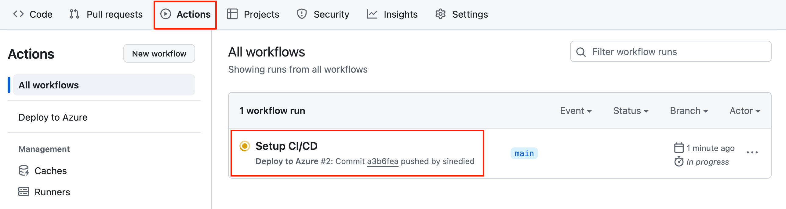

Then select the job named **deploy** on the left, and you should see the logs of the workflow.

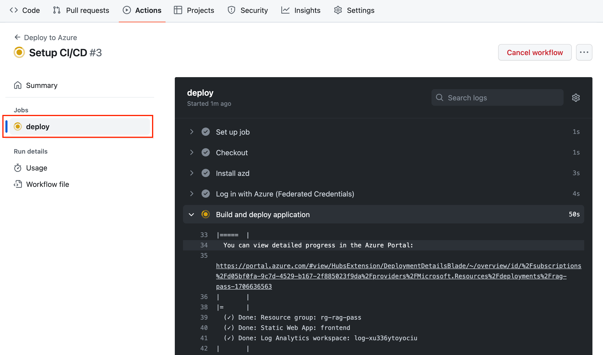

When the workflow is complete, you should see a green checkmark.


---

<div class="info" data-title="skip notice">

> This step is entirely optional, you can skip it if you want to jump directly to the next section.

</div>

## Optional improvements

We now have a working application, but there are still a few things we can improve to make it better, like adding a follow-up questions feature.

### Add follow-up questions

After your agent has answered the user's question, it can be useful to provide some follow-up questions to the user, to help them find the information they need.

In order to do that, we'll improve our original prompt. Open the file `packages/agent-api/src/functions/chat-post.ts` and update the system prompt to include this under the `## Task` section:

```md
## Task
1. Help the user with their request, ask any clarifying questions if needed.
2. ALWAYS generate 3 very brief follow-up questions that the user would likely ask next, as if you were the user.
Enclose the follow-up questions in double angle brackets. Example:
<<Do you have vegan options?>>
<<How can I cancel my order?>>
<<What are the available sauces?>>
Make sure the last question ends with ">>", and phrase the questions as if you were the user, not the assistant.
```

Let's analyze this prompt to understand what's going on:

1. We ask the model to generate 3 follow-up questions: `Generate 3 very brief follow-up questions that the user would likely ask next.`
2. We specify the format of the follow-up questions: `Enclose the follow-up questions in double angle brackets.`
3. We use the few-shot approach to give examples of follow-up questions:
    ```
    <<Do you have vegan options?>>
    <<How can I cancel my order?>>
    <<What are the available sauces?>>
    ```
4. After testing, we improved the prompt with: `Make sure the last question ends with ">>".` and `phrase the questions as if you were the user, not the assistant.`.

<div class="info" data-title="Note">

> The double angle brackets formatting is arbitrary and specific to work with our chat web component. You can choose any other format you want, just make sure to update the parsing logic in the agent-webapp.

</div>

That's it!
You can now test your changes by running the burger MCP server, the agent API and the agent webapp again.

In the agent webapp you should now see the follow-up questions after you get an answer:

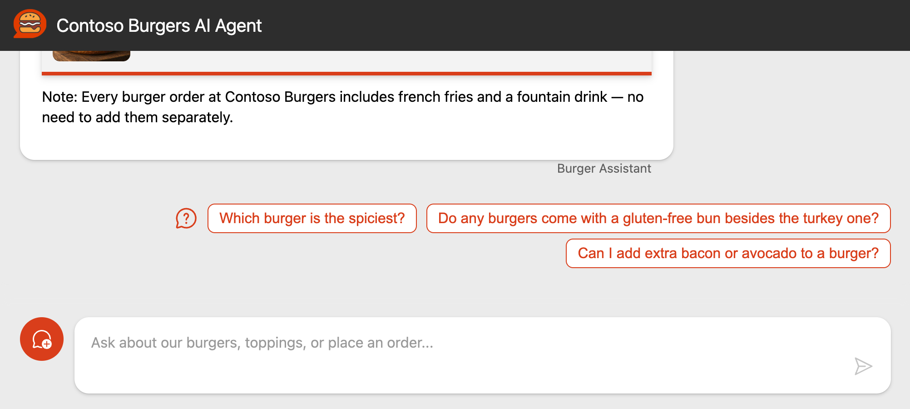

You can now redeploy your improved agent by running `azd deploy agent-api` and test it in production.

<!-- TODO:

### Implementing chat history

The current version of the chat API is using the `chat` endpoint to send the messages and get the response once the model has finished generating it. This creates longer wait times for the user, which is not ideal.

OpenAI API have an option to stream the response message, allowing to see the response as soon as it's generated. 
While it doesn't make the model generate the response faster, it allows you to display the response to the user faster so they can start reading it directly while it's being generated. -->


---

## Conclusion

This is the end of the workshop. We hope you enjoyed it, learned something new and more importantly, that you'll be able to take this knowledge back to your projects.

If you missed any of the steps or would like to check your final code, you can run this command in the terminal **at the root of the project** to get the completed solution (be sure to commit your code first!):

```bash
curl -fsSL https://github.com/Azure-Samples/mcp-agent-langchainjs/releases/download/latest/solution.tar.gz | tar -xvz
```

<div class="warning" data-title="had issues?">

> If you experienced any issues during the workshop, please let us know by [creating an issue](https://github.com/Azure-Samples/mcp-agent-langchainjs/issues) on the GitHub repository.

</div>

### Cleaning up Azure resources

<div class="important" data-title="important">

> Don't forget to delete the Azure resources once you are done running the workshop, to avoid incurring unnecessary costs!

</div>

To delete the Azure resources, you can run this command:

```bash
azd down --purge
```

### Going further

This workshop is based on the enterprise-ready sample **AI Agent with MCP tools using LangChain.js**, available in the same repository as the one you used for the workshop: https://github.com/Azure-Samples/mcp-agent-langchainjs

You'll notice a few differences between the workshop code and the sample code, as the sample code includes more advanced features such as authentication, conversation history, Agent CLI, data generation and more. If you want to go further with more advanced use-cases, authentication, history and more, you should check it out!

If you're more interested in learning about LangChain.js and its usage in agentic applications, you can take a look at this free online course: [LangChain.js for Beginners](https://github.com/microsoft/langchainjs-for-beginners).

### References

- This workshop URL: [aka.ms/ws/mcp-agent](https://aka.ms/ws/mcp-agent)
- The source repository for this workshop: [GitHub link](https://github.com/Azure-Samples/mcp-agent-langchainjs)
- If something does not work: [Report an issue](https://github.com/Azure-Samples/mcp-agent-langchainjs/issues)
- Introduction presentation for this workshop: [Slides](https://azure-samples.github.io/mcp-agent-langchainjs/)

